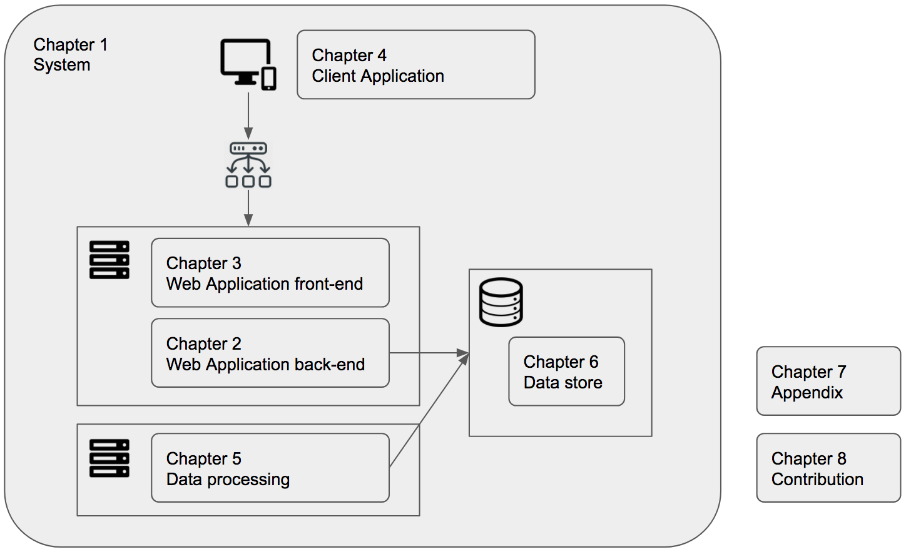

= Architext

Architext is a combination of architecture and textbook, having a bit similar sound with architect.
We hope it'll become handy reference of system architecture design for tech leads or software engineers.

== Overview
Here we show the rough structure and chapters of Architext.
We're trying to keep it straightforward as much as possible though it's almost impossible to 100% handle overwrap, duplication, interdependency, or fragmentation

Chapter 1: System:: mimimi
Chapter 2: Web Application bach-end:: mimimi
Chapter 3: Web Application front-end:: mimimi
Chapter 4: Client Application:: hihihi
Chapter 5: Data Processing:: ji
Chapter 6: Data Store:: h
Chapter 7: Appendix:: h
Chapter 8: Contribution:: h

